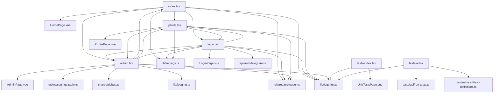
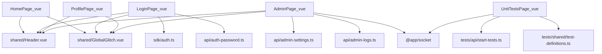

# Импорты страниц и схема зависимостей

## Назначение

Сводный список импортов **всех страниц** + схема зависимостей для быстрого поиска циклов.

## Когда обновлять

- При добавлении/удалении страниц (tsx/vues).
- При изменении импортов в файлах страниц.
- При реорганизации роутинга или shared‑модулей.

---

## 1) Страницы‑роуты (TSX entrypoints)

### `./index.tsx`

- `@app/html-jsx` → `jsx`
- `./pages/HomePage.vue`
- `./profile`
- `./login`
- `./admin`
- `./lib/settings`
- `./shared/preloader`
- `./lib/logs-init` (side‑effect)

### `./login.tsx`

- `@app/html-jsx` → `jsx`
- `@app/auth/provider` → `getEnabledAuthProviders`
- `./pages/LoginPage.vue`
- `./api/auth-telegram`
- `./lib/settings`
- `./admin`
- `./profile`
- `./shared/preloader`
- `./lib/logs-init` (side‑effect)

### `./profile.tsx`

- `@app/html-jsx` → `jsx`
- `@app/auth` → `requireRealUser`
- `./pages/ProfilePage.vue`
- `./login`
- `./admin`
- `./lib/settings`
- `./shared/preloader`
- `./lib/logs-init` (side‑effect)

### `./admin.tsx`

- `@app/html-jsx` → `jsx`
- `@app/auth` → `requireAccountRole`
- `@app/socket` → `genSocketId`
- `./pages/AdminPage.vue`
- `./tables/settings.table`
- `./shared/debug`
- `./lib/logging`
- `./index`
- `./profile`
- `./login`
- `./shared/preloader`
- `./lib/logs-init` (side‑effect)

### `./tests/index.tsx`

- `@app/html-jsx` → `jsx`
- `@app/auth` → `requireAnyUser`
- `./pages/UnitTestsPage.vue`
- `../lib/logs-init` (side‑effect)

### `./tests/ai.tsx`

- `@app/auth` → `requireAnyUser`
- `./shared/test-definitions`
- `./api/run-tests`
- `../lib/logs-init` (side‑effect)

---

## 2) Страницы‑компоненты (Vue)

### `./pages/HomePage.vue`

- `vue` → `onMounted`, `ref`
- `../shared/Header.vue`
- `../shared/GlobalGlitch.vue`

### `./pages/LoginPage.vue`

- `vue` → `ref`, `computed`, `onMounted`, `onUnmounted`
- `../sdk/auth`
- `../api/auth-password`
- `../shared/Header.vue`
- `../shared/GlobalGlitch.vue`

### `./pages/ProfilePage.vue`

- `vue` → `onMounted`, `ref`
- `../shared/Header.vue`
- `../shared/GlobalGlitch.vue`

### `./pages/AdminPage.vue`

- `vue` → `ref`, `onMounted`, `onBeforeUnmount`, `computed`
- `@app/socket` → `getOrCreateBrowserSocketClient`
- `../shared/Header.vue`
- `../shared/GlobalGlitch.vue`
- `../api/admin-settings`
- `../api/admin-logs`

### `./tests/pages/UnitTestsPage.vue`

- `vue` → `ref`, `computed`, `onMounted` (1‑й import‑блок)
- `../shared/test-definitions` (1‑й import‑блок)
- `../api/start-tests` (1‑й import‑блок)

> В файле есть **второй import‑блок** (начиная с ~379 строки), который частично дублирует первый и добавляет `@app/socket`:
>
> - `vue` → `ref`, `onMounted`, `onUnmounted`, `computed`
> - `../api/start-tests`
> - `../shared/test-definitions`
> - `@app/socket` → `getOrCreateBrowserSocketClient`

---

## 3) Схема импортов (для контроля циклов)

### 3.1 Роуты (TSX)



### 3.2 Vue‑страницы (high‑level)



---

## 4) Явные/потенциальные циклы

- `index.tsx` ↔ `admin.tsx` (взаимные импорты).
- `index.tsx` ↔ `login.tsx` ↔ `profile.tsx` ↔ `admin.tsx` → обратно.
- `login.tsx` ↔ `admin.tsx` и `profile.tsx` ↔ `admin.tsx`.

**Как отслеживать:**

**⚠️ НОВОЕ ПРАВИЛО** (с 2026-01-30):

**На серверной стороне (в роутах TSX):**

- ✅ Используйте **относительные пути**:
  - `./admin` - для файлов на том же уровне
  - `../profile` - для выхода на уровень вверх
- ❌ НЕ используйте `.url()` на сервере (вызывает циклические зависимости)
- ❌ **КРИТИЧЕСКАЯ ОШИБКА**: НЕ используйте абсолютные пути типа `'/admin'` - это от корня домена!
  - Пример: проект в `/p/gc/partnership/`, путь `'/admin'` → `https://domain.com/admin` (неверно!)
  - Правильно: `'./admin'` (если на одном уровне) → `https://domain.com/p/gc/partnership/admin`

**Для фронтенда (Vue компоненты):**

- ✅ Можно использовать `.url()` — это фронтенд (см. 002-routing.md)
- ✅ Или используйте относительные пути, если есть циклические зависимости

**При циклических зависимостях:**

- Используйте переменные из `/config/routes.ts`
- ⚠️ **КРИТИЧЕСКАЯ ОШИБКА**: Хардкодить URL запрещено!

**Другие правила:**

- ✅ Выносите общие функции/константы в `lib/` и `shared/`.
- ✅ Для файлов таблиц: **НЕ импортируйте** ничего кроме `{ Heap } from '@app/heap'` (см. ошибку #7 в 008-heap.md).

**Примеры правильного использования:**

```typescript
// ❌ НЕПРАВИЛЬНО - хардкод абсолютного пути
const url = '/admin'

// ❌ НЕПРАВИЛЬНО - .url() на сервере с циклическими зависимостями
import { adminRoute } from '../admin' // Цикл!
const url = adminRoute.url()

// ✅ ПРАВИЛЬНО - относительный путь на сервере
const url = './admin'

// ✅ ПРАВИЛЬНО - .url() для передачи на фронтенд (без циклов)
import { settingsRoute } from '../settings' // Нет цикла
const frontendUrl = settingsRoute.url()

// ✅ ПРАВИЛЬНО - полный URL при циклических зависимостях
import { getFullUrl, ROUTES } from '../config/routes'
const adminUrl = getFullUrl(ROUTES.admin)
```

---

## 5) Примечания

- В большинстве страниц есть `./lib/logs-init` как side‑effect‑импорт — учитывать при рефакторинге.
- В `tests/pages/UnitTestsPage.vue` есть два import‑блока; при чистке оставить один, чтобы схема была однозначной.

## Связанные документы платформы

- **002-routing.md** — **ОБНОВЛЕНО**: Относительные пути на сервере, `.url()` только для фронтенда
- **006-arch.md** — Структура проекта и правила организации файлов
- **008-heap.md** — Ошибка #7: Циклические зависимости в файлах таблиц (критическая ошибка!)
