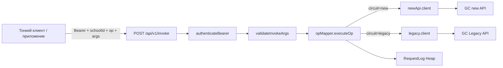

# Architecture

## Назначение
Приложение **`p/saas/gateways/gc_api`** — каркас **gateway GetCourse** на платформе Chatium (наследует возможности `template_project`: страницы, админка, логи, тесты). Целевое назначение по продукту: HTTP-слой `op` + `args`, хранение dev-ключа GC на сервере, прокси к новому и Legacy API — см. спецификацию слоя Gateway в материалах курса Chatium+GC и реестр `op` v0.

## Ограничения платформы
- Серверная инфраструктура предоставляется Chatium.
- Нельзя менять стек и зависимости.
- Деплой — автоматически при пуше.

## Основные сценарии
- Открыть главную страницу.
- Авторизоваться и попасть в профиль.
- Открыть админку (только роль Admin).

## Роутинг
- `index.tsx` — главная (SSR + Vue), единственный роут в корне.
- `web/admin/index.tsx` — админка, `requireAccountRole('Admin')`.
- `web/profile/index.tsx` — профиль, `requireRealUser()`.
- `web/tests/index.tsx` — страница тестов, `requireRealUser()`.
- `web/login/index.tsx` — вход (редирект на системный `/s/auth/signin`).

## Вёрстка админки и страницы тестов
- Корень Vue (`.app-layout` в `AdminPage.vue` / `TestsPage.vue`) ограничен высотой окна (`100vh` / `100dvh`) с `overflow: hidden`; после `boot-complete` у `body` нет вертикального скролла. Ширина: `.app-layout`, `<main class="ap-wrap|tp-wrap">` и блок `.ap` / `.tp` — на всю доступную ширину (`width: 100%`, у обёрток при необходимости `min-width: 0` для flex); контент по-прежнему ограничен `max-width: 1440px` у `.ap`/`.tp`. `<main>` — flex-колонка с `overflow: hidden` (сам не скроллится). Ниже — `.ap` / `.tp` (flex, `min-height: 0`), статус/тулбар `flex-shrink: 0`, сетка `.ap-grid` / `.tp-grid` с `grid-template-rows: minmax(0, 1fr)` и `flex: 1`; в двухколоночном режиме первая колонка — `minmax(240px, 1fr)` (не `minmax(0, 1fr)`), чтобы левая область не сжималась чрезмерно. Вертикальный скролл только у левой колонки `.ap-main` / `.tp-main` (`overflow-y: auto`, класс `content-wrapper` для стилей скроллбара). Правая колонка логов тянется по высоте ячейки сетки; список строк — `.ap-log-out` / `.tp-log-out` с внутренним `overflow-y`. На узкой вёрстке снова скроллится весь `<main>`.

## Разделение слоёв

Принцип разделения ответственности при работе с данными (см. [ADR-0002](ADR/0002-settings-heap-and-layered-api.md)):

| Слой | Каталог | Ответственность |
| --- | --- | --- |
| **Таблицы** | `tables/` | Схемы Heap (поля, типы). Только определение структуры данных. |
| **Репозитории** | `repos/` | Работа с БД: CRUD, запросы. Никакой бизнес‑логики, только вызовы Heap API. |
| **Бизнес‑логика** | `lib/` | Правила, дефолты, валидация значений, вычисления. Вызывает репозитории. |
| **API** | `api/` | HTTP‑эндпоинты, парсинг и первичная валидация запросов, проверка прав. Вызывает lib. |

Поток данных: `HTTP → API → lib → repos → Heap`.

## Структура каталогов
- `config/` — маршруты и `PROJECT_ROOT`.
- `web/` — браузерные роуты модулей (admin, profile, tests, login).
- `pages/` — Vue‑страницы (минимальные).
- `components/` — переиспользуемые Vue‑компоненты (Header, AppFooter, GlobalGlitch, LogoutModal).
- `api/` — API‑эндпоинты (получение и валидация входных данных). File-based: один файл — один эндпоинт с `/`. В т.ч. **`api/v1/`** — публичный контракт gateway (invoke, operations, health, onboard, rotate-token); **`api/admin/`** — школы, каталог, логи invoke, GC settings; шаблонные `api/settings/*`, `api/logger/*`, `api/tests/*`.
- `tables/` — Heap‑таблицы: settings, logs, **gatewaySchool**, **opCatalog**, **requestLog**, **openapiCache**.
- `repos/` — репозитории (settings, logs, **gatewaySchool**, **opCatalog**, **requestLog**, **openapiCache**).
- `lib/` — бизнес‑логика: settings, logger, **crypto/authToken/correlation**, **openapiLoader/catalogBuilder/catalogEnsure**, **gcClients (new/legacy)**, **opMapper**, **errorNormalizer**, **argsValidator**, **jsonSchemaValidate**, **requestLogger**, **gatewayOnboard/gatewayRotate**, **legacyExportLimit**, admin/dashboard и др.
- `shared/` — общий код (`// @shared`): **opRegistry**, **legacyArgSchemas**, preloader, logLevel, logger, browserRemoteLogger, testCatalog.
- `docs/` — документация проекта.

## Поток gateway (исходящий вызов)

Входящие HTTP от GetCourse на gateway **не** приходят — см. [ADR-0003](ADR/0003-gateway-outgoing-only.md).

## Стратегия логирования

Логирование построено на стандарте syslog (RFC 5424), severity 0–7. Управление уровнем через настройку `log_level` (Debug/Info/Warn/Error/Disable).

| Severity | Уровень | Что логируется |
| --- | --- | --- |
| 7 | Debug | Сырые данные (параметры, возвраты, промежуточные значения) — появляются только при Debug |
| 6 | Info | Карта вызовов: entry/exit функций, ветвления — без сырых данных при уровне Info |
| 5 | Notice | Пользовательские действия (клик, навигация, изменение настроек) |
| 4 | Warning | Нештатные ситуации, не требующие немедленной реакции |
| 3 | Error | Ошибки, требующие внимания |
| 2 | Critical | Критические действия (выход из аккаунта) |
| -1 | Disable | Логи выключены |

**Ключевой принцип**: trace-логи (карта вызовов) имеют severity 6 (Info). Payload (сырые данные) автоматически отсекается при уровне != Debug:
- **Сервер** (`lib/logger.lib.ts`): функция `shouldIncludePayload` — payload в ctx.account.log, Heap, WebSocket и webhook только при Debug.
- **Браузер** (`shared/logger.ts`): `emitLog` фильтрует non-string args при уровне != Debug.

## Интеграции
- **GetCourse (исходящие вызовы):** `@app/request` в `lib/gcClients/*`; контуры **new** (Bearer devKey+school key по спецификации клиента) и **Legacy** (form key/action/params); ретраи и лимиты — см. `lib/opMapper.lib.ts`, `lib/legacyExportLimit.lib.ts`.
- **OpenAPI:** загрузка и кеш схемы — `lib/openapiLoader.lib.ts` ([ADR-0006](ADR/0006-openapi-as-ssot.md)).
- Внутренние SDK: `@app/heap`, `@app/request`, `@app/auth`, `@app/jobs`, `@app/sync` и др.
