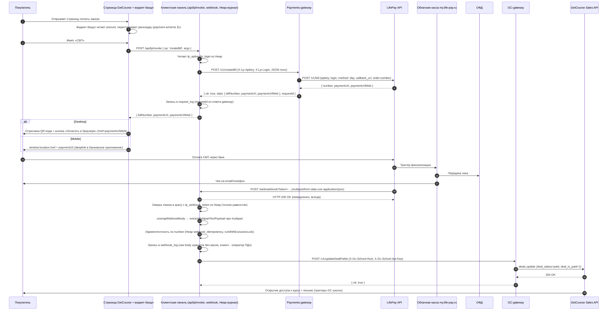

# Поток данных системы

Высокоуровневая карта взаимодействий между **двумя Chatium-приложениями проекта** (payments-gateway и единая клиентская панель), школой GetCourse и LifePay. Подробности контрактов, ошибок, секретов - в [operation-manual](../../../../saas/gw/lifepay/docs/gateway/operation-manual.md); бизнес-логика отображения способов оплаты - в [payment-scheme](../../sbp-client/docs/architecture/payment-scheme.md). Этот документ существует для быстрой ориентации: какое приложение что делает, какие каналы данных проходят между ними.

> **Архитектурные решения по клиентской стороне (см. [operation-manual §12.1](../../../../saas/gw/lifepay/docs/gateway/operation-manual.md), пересмотр 15-05-2026; [implementation-plan §1.8](../../../../saas/gw/lifepay/docs/gateway/implementation-plan.md)):**
>
> 1. Промежуточного SDK-приложения между клиентом и payments-gateway нет. Клиент сам формирует HTTP-запрос к публичному URL gateway с заголовками `X-Lp-Apikey` / `X-Lp-Login`.
> 2. Три ранее планировавшихся client-приложения (виджет / тестовая страница / приёмник webhook) объединены в **одну клиентскую панель** `p/units/aayakovleva/sbp-client`. Панель хранит секреты магазина, проксирует запросы JS-страницы к gateway, ведёт журнал, показывает дашборд и принимает webhook от LifePay.

## 1. Состав системы

| Компонент             | Что это                                                                                                                                                                                                                 | Где живёт                                              | Роль                                                                                                                                                                                                                                                                                                                                                                                                                                                                                                                                                                                                                                                                                                                                                                                                      |
| --------------------- | ----------------------------------------------------------------------------------------------------------------------------------------------------------------------------------------------------------------------- | ------------------------------------------------------ | --------------------------------------------------------------------------------------------------------------------------------------------------------------------------------------------------------------------------------------------------------------------------------------------------------------------------------------------------------------------------------------------------------------------------------------------------------------------------------------------------------------------------------------------------------------------------------------------------------------------------------------------------------------------------------------------------------------------------------------------------------------------------------------------------------- |
| **Клиентская панель** | Chatium-приложение с UI (главная: журнал + аналитика), серверной прокладкой `POST /api/lp/invoke`, приёмником `POST /web/webhook?token=...` и (в MVP) виджет-бандлом `widget/payment.js` для встраивания на страницу GC | `p/units/aayakovleva/sbp-client`                       | (а) Хранит в Heap `lp_apikey`, `lp_login`, `lp_webhook_token`, `gateway_base_url`. (б) Принимает запросы от JS (вкладка «Создать счёт» в Прототипе, виджет-бандл в MVP), делает прямой HTTP-вызов `POST /api/v1/{op}` к payments-gateway с заголовками `X-Lp-Apikey` / `X-Lp-Login`, пишет `request_log` в свой Heap. (в) Принимает webhook от LifePay (формат `multipart/form-data` фактически, `application/json` по доке - оба развёртываются `lib/webhook/processWebhook.unwrapWebhookBody`), сверяет токен в query, пишет `webhook_log`, дедуплицирует по `number` через `webhook_idempotency` (`runWithExclusiveLock`); в MVP - обновляет статус заказа через GC-gateway. **MD5-подпись не проверяется** (LifePay её не публикует, решение 15-05-2026). Доступ к UI - `Admin` (Андрей-разработчик). |
| **Payments-gateway**  | Сервис с роутами `/v1/{op}`                                                                                                                                                                                             | Chatium-приложение `p/saas/gw/lifepay`                 | Принимает HTTP-запросы от клиентской панели, валидирует, проксирует в LifePay, нормализует ответ. Боевые `apikey`/`login` не хранит - читает их из заголовков входящего запроса (§5.6 manual).                                                                                                                                                                                                                                                                                                                                                                                                                                                                                                                                                                                                            |
| **GC-gateway**        | Внешнее приложение (отдельный проект)                                                                                                                                                                                   | Chatium-приложение `p/saas/gw/gc`                      | Обновляет заказ в GetCourse (`updateDealFields` или эквивалент). Не входит в скоуп этого проекта, используется как уже существующий сервис.                                                                                                                                                                                                                                                                                                                                                                                                                                                                                                                                                                                                                                                               |
| **LifePay**           | Внешний провайдер                                                                                                                                                                                                       | `api.life-pay.ru/v1` + `my.life-pay.ru` (фискализация) | Создаёт счёт, формирует чек, шлёт webhook на приёмник клиентской панели.                                                                                                                                                                                                                                                                                                                                                                                                                                                                                                                                                                                                                                                                                                                                  |
| **GetCourse**         | Внешняя CRM                                                                                                                                                                                                             | Школа Яковлевых на собственном поддомене GetCourse     | Хранит заказ, отображает страницу оплаты с встроенным виджет-бандлом, принимает обновление статуса.                                                                                                                                                                                                                                                                                                                                                                                                                                                                                                                                                                                                                                                                                                       |

## 2. Sequence: создание счёта и оплата

## 3. Каналы данных и обязательные заголовки

| Канал                                                                 | Транспорт                                                                                                                                                               | Авторизация                                                                                                                                               | Кто хранит секрет                                                                                                                            |
| --------------------------------------------------------------------- | ----------------------------------------------------------------------------------------------------------------------------------------------------------------------- | --------------------------------------------------------------------------------------------------------------------------------------------------------- | -------------------------------------------------------------------------------------------------------------------------------------------- |
| Виджет-бандл (JS на странице GC) → клиентская панель `/api/lp/invoke` | HTTPS `fetch` (CORS на стороне панели)                                                                                                                                  | Origin-чек + per-school токен в заголовке `X-Panel-Token` (Часть 2 §2.7); в Прототипе вкладка «Создать счёт вручную» - `requireAccountRole(ctx, 'Admin')` | Per-school токен прошивается в бандл; Origin-список школ в Heap панели                                                                       |
| Клиентская панель → payments-gateway                                  | HTTPS, `@app/request`                                                                                                                                                   | Заголовки `X-Lp-Apikey`, `X-Lp-Login`                                                                                                                     | Heap панели (`lp_apikey`, `lp_login`)                                                                                                        |
| Payments-gateway → LifePay                                            | HTTPS, `@app/request`                                                                                                                                                   | Поля `apikey`, `login` в теле JSON (POST) или query (GET)                                                                                                 | Не хранит (берёт из заголовков входящего запроса, см. [operation-manual §5.6](../../../../saas/gw/lifepay/docs/gateway/operation-manual.md)) |
| LifePay → клиентская панель `/web/webhook`                            | HTTPS, фактически `multipart/form-data` (поле `data` с JSON-строкой), также `application/json` и `application/x-www-form-urlencoded` поддерживаются `unwrapWebhookBody` | Случайный токен в URL `?token=...` (≥ 32 символов). MD5-подпись **не используется** - LifePay её не публикует.                                            | Токен `lp_webhook_token` в Heap панели                                                                                                       |
| Клиентская панель → GC-gateway                                        | HTTPS, `@app/request`                                                                                                                                                   | Заголовки `X-Gc-School-Host`, `X-Gc-School-Api-Key`                                                                                                       | Heap панели                                                                                                                                  |
| GC-gateway → GetCourse                                                | HTTPS                                                                                                                                                                   | `Authorization: Bearer {devKey}_{schoolApiKey}` (для контура `new`)                                                                                       | Heap GC-gateway (dev-key) + входящий заголовок (school-key)                                                                                  |

## 4. Где какие секреты живут

| Секрет                                          | Хранится               | Используется                                                                   |
| ----------------------------------------------- | ---------------------- | ------------------------------------------------------------------------------ |
| `lp_apikey` магазина LifePay                    | Heap клиентской панели | Заголовок `X-Lp-Apikey` при каждом вызове payments-gateway                     |
| `lp_login` магазина LifePay (телефон владельца) | Heap клиентской панели | Заголовок `X-Lp-Login`                                                         |
| `lp_webhook_token` URL вебхука (≥ 32 символа)   | Heap клиентской панели | Проверка query-параметра `?token=` при приёме webhook (точное равенство строк) |
| `apikey` GetCourse школы                        | Heap клиентской панели | Заголовок `X-Gc-School-Api-Key` при вызове GC-gateway                          |
| `gc_developer_api_key`                          | Heap GC-gateway        | Bearer-токен при вызовах GetCourse                                             |
| `lp_test_apikey`, `lp_test_login`               | Heap payments-gateway  | Только для интеграционных тестов payments-gateway                              |

Боевые `apikey` / `login` магазина LifePay никогда не хранятся в Heap payments-gateway. Передача через заголовок входящего запроса - единственный канал. Подробности и обоснование в [operation-manual §5.6](../../../../saas/gw/lifepay/docs/gateway/operation-manual.md).

## 5. Границы и инварианты

- **Webhook от LifePay не приходит на payments-gateway.** Его принимает клиентская панель (см. [operation-manual §6](../../../../saas/gw/lifepay/docs/gateway/operation-manual.md), ADR 0002 если оформлен).
- **Идемпотентность webhook живёт в клиентской панели**, не в payments-gateway. Сам gateway не дедуплицирует и не ретраит, один входящий → один исходящий (см. [operation-manual §8.6](../../../../saas/gw/lifepay/docs/gateway/operation-manual.md)).
- **Обновление статуса заказа в GetCourse не входит в скоуп payments-gateway**: это вызов другого, уже существующего gateway-приложения `p/saas/gw/gc`, который инициирует клиентская панель.
- **Виджет не вызывает LifePay напрямую и не вызывает payments-gateway напрямую.** Между Vue-кодом виджета и LifePay всегда два слоя: клиентская панель (промежуточная прокладка с журналом и секретами) и payments-gateway. Это даёт единую точку логирования, единое место хранения секретов магазина и независимость виджета от смены провайдера.
- **Промежуточного SDK-приложения нет.** Единственная клиентская панель `p/units/aayakovleva/sbp-client` общается с payments-gateway напрямую по HTTP - см. [operation-manual §12.1](../../../../saas/gw/lifepay/docs/gateway/operation-manual.md) (решение пересмотрено 15-05-2026, тогда же три ранее планировавшихся client-приложения объединены в эту панель).
- **MD5-подпись webhook не верифицируется.** LifePay её не публикует в [apidoc.life-pay.ru/notification](https://apidoc.life-pay.ru/notification/index); единственный механизм аутентификации - токен `?token=...`. Решение зафиксировано 15-05-2026 после проверки live-документации, отражено в [operation-manual §6.2 / §6.4](../../../../saas/gw/lifepay/docs/gateway/operation-manual.md).
- **Multipart-тело webhook читается нативно** через `req.body` (патч Chatium от 18-05-2026, Artur Eshenbrener). До патча использовался обход через `req.files`/`req.fields` + `extractMultipartTextPayload`; этот хелпер сохранён как защитный fallback в `lib/webhook/processWebhook.ts`. План переезда на VDS (`docs/webhook-proxy/`), подготовленный 17-05-2026 как страховка, отменён.

## 6. Связанные документы

- [payment-scheme](../../sbp-client/docs/architecture/payment-scheme.md) - бизнес-логика виджета (порядок отображения способов оплаты, переключение по сумме 50 000 ₽).
- [../gateway/operation-manual](../../../../saas/gw/lifepay/docs/gateway/operation-manual.md) - SSOT разработки payments-gateway.
- [../gateway/testing-strategy](../../../../saas/gw/lifepay/docs/gateway/testing-strategy.md) - стратегия тестов.
- [../gateway/implementation-plan](../../../../saas/gw/lifepay/docs/gateway/implementation-plan.md) - пошаговый план Прототип → MVP → Прод.
- [../decisions/0001-lifepay-api-choice](../../../../saas/gw/lifepay/docs/ADR/0003-lifepay-api-choice.md) - выбор контура `bills_v1`.
- [../knowledge/lifepay/cabinets](../knowledge/lifepay/cabinets.md) - карта кабинетов LifePay.
- [../knowledge/lifepay/webhooks](../knowledge/lifepay/webhooks.md) - формат webhook и MD5-верификация.
