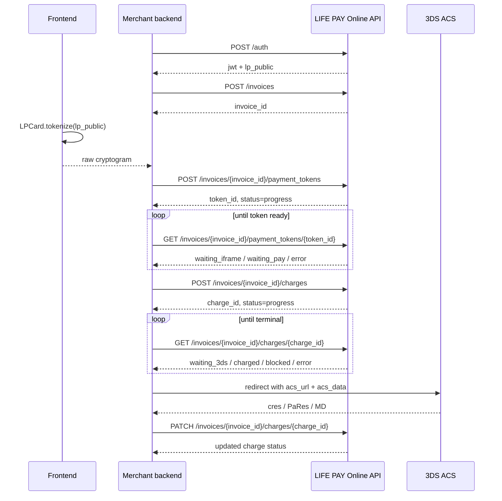

> ⚠️ **Снапшот от 10.05.2026.** Это исторический research-отчёт по экосистеме LIFE PAY до диалога с поддержкой 12.05.2026. Не учитывает разделение кабинетов (`my.life-pay.ru` vs `home.life-pay.ru`), уточнения по `POST /v1/bill` с `method: "sbp"` и развилку сценариев A/B для проекта Ольги.
>
> **Актуальные источники (приоритет на них):**
>
> - [cabinets](cabinets.md) — карта кабинетов и развилка сценариев (главное)
> - [README](README.md) — индекс раздела
> - [api-contracts](api-contracts.md) — оба API с актуальными полями
> - [webhooks](webhooks.md) — оба контура webhook
> - [js-integration](js-integration.md) — варианты A, B, C
> - [receipt-fz54](receipt-fz54.md) — фискализация по сценариям
>
> Файл оставлен как evergreen-source для общего ландшафта (LIFE POS API v6, NFC v1, статусы invoice/charge, 3DS-механика, безопасность, чек-лист), но как первичный источник по интеграции под проект Ольги больше не используется.
>
> **Происхождение.** Полный текст deep-research-отчёта по экосистеме LIFE PAY (сохранён 2026-05-10). Содержит сводную карту API, разбор `LIFE PAY Online API v1`, `API кассовых ссылок СБП v2`, `LIFE POS API v6`, ECOM Checkout SDK, облачной фискализации, безопасности, тестового контура, чек-листа и плана тестирования.

# LIFE PAY для интегратора

## Executive summary

Экосистема urlLIFE PAYhttps://life-pay.ru даёт интегратору не один, а несколько параллельных контуров разработки: интернет-эквайринг `LIFE PAY Online API` для онлайн-оплаты, JavaScript/SDK-слой `ECOM Checkout` для клиентской токенизации карты, отдельные API кассовых ссылок entity["organization","Система быстрых платежей","российская платёжная система"] v1/v2, большой ресурсный `LIFE POS API v6` для кассового/товарного/операционного бэкенда, а также API облачной фискализации. Для задачи «принять онлайн-платёж, отследить статус, сделать возврат, поддержать hold/capture и рекурренты» ключевым является именно `LIFE PAY Online API v1`; для СБП-кассовых ссылок — отдельный v2 API; для отчётности и кассовой автоматизации — `LIFE POS API v6`. citeturn17view11turn20view0turn11view0turn15view0

Главная сильная сторона публичной документации — хороший разбор транзакционного контура: авторизация, счета, токены, списания, 3DS, холдирование, возвраты, рекуррентные списания, QR-коды СБП и callback-механика. Главная слабая сторона — фрагментация документации: продуктовые статьи `LIFE PAY Online 2.0` помечены как unreleased, а актуальные endpoint-карточки живут в `API Интернет-эквайринг` версии 1.0; часть инструкций по личному кабинету указывает на новый ЛК, часть — на старый; для ряда вещей (например, вебхуки интернет-эквайринга, числовые rate limits, SLA, подпись callback-ов) документация неполна или описана только в старом `apidoc`. citeturn11view1turn11view2turn13view1turn41view0turn50view0

Если смотреть глазами интегратора, оптимальная стратегия такая: на фронте — клиентская токенизация через `ECOM Checkout` и `lp_public`; на бэкенде — `POST /auth`, затем работа через Bearer JWT с `invoices`, `payment_tokens`, `charges`, `refunds`, `qr_codes`, `blocked` и `recurrents`; для СБП-кассовых ссылок — отдельный v2 API с собственным форматом ошибок, где бизнес-ошибка часто приходит внутри HTTP 200. Числовой лимит запросов в `Online API` не опубликован, но 429 `too_many_requests` в спецификации есть; в `SBP links v2` бизнес-ошибки документированы кодами тела ответа, а не HTTP-статусами. citeturn41view1turn40view3turn33view3turn15view0turn44view0turn52view1turn52view3

Практический вывод: для нового e-commerce проекта сервис закрывает типовой платёжный стек почти полностью — hosted/payment-form, API, токенизацию, 3DS, QR/SBP, рекурренты, возвраты и фискализацию. Но перед продом стоит отдельно пройти технический gate: подтвердить точные боевые URL, webhook-политику, IP allowlist, текущую схему выдачи API-ключей в ЛК, документы по `PCI DSS` и желаемый контур отчётности. На странице сертификатов компания прямо заявляет соответствие `PCI DSS`. citeturn13view1turn11view1turn11view0turn49search0

## Карта сервиса и документации

Сервис публикует несколько официальных поверхностей интеграции, и для проекта важно не смешивать их роли. Ниже — карта, собранная из основного каталога документации, quick-start материалов и Swagger/OpenAPI-страниц. citeturn17view11turn20view0turn11view1turn11view0

| Поверхность                  | Что покрывает                | Что реально можно реализовать                                                                                                                                        | Комментарий для интегратора                                                      |
| ---------------------------- | ---------------------------- | -------------------------------------------------------------------------------------------------------------------------------------------------------------------- | -------------------------------------------------------------------------------- |
| `LIFE PAY Online API v1`     | Интернет-эквайринг           | Авторизация, настройки магазина, выставление счёта, обновление/деактивация счёта, токенизация, списание, 3DS, статус, возврат, QR СБП, hold/capture/void, рекурренты | Это основной платёжный API для сайта/приложения.                                 |
| `ECOM Checkout (SDK)`        | Клиентский JS SDK            | Токенизация карты, валидация карты, обёртки над `ChargeApi`, `InvoiceApi`, `QRApi`, `ServiceApi`, `TokenApi`                                                         | Это предпочтительный способ не пропускать PAN через ваш сервер.                  |
| `API кассовых ссылок СБП v2` | QR/NFC/кассовые ссылки СБП   | Активация/деактивация ссылки, проверка оплаты, отмена сессии, возврат, статус возврата, callback-и                                                                   | Отдельный API и отдельная модель ошибок.                                         |
| `API NFC меток СБП v1`       | Legacy-контур СБП            | Активация, динамическая ссылка, возврат, статус продажи, статус возврата, список банков/тенантов                                                                     | Для нового проекта — только если нужен legacy-функционал вроде `list_merchants`. |
| `LIFE POS API v6`            | Кассовый/операционный бэкенд | Продажи, сессии, товары, сотрудники, юрлица, терминалы, транзакции, отчёты, экспорт/импорт, роли, организации, выручка                                               | Это уже не только платёжный API, а полноценный POS/back-office API.              |
| Облачная фискализация        | Печать и обработка чеков     | Отправка чеков, callback-и, тестовый и продовый API                                                                                                                  | Нужна, если вы хотите закрыть 54‑ФЗ в одном контуре.                             |
| Legacy `apidoc`              | Старые, но полезные страницы | Вебхуки по транзакциям, повторы уведомлений, legacy `/transactions`                                                                                                  | Нужен как вспомогательный источник, когда в новой документации чего-то нет.      |

Перечень публичных resource-групп в `LIFE POS API v6` очень широкий: `AsyncTasks`, `Auth`, `Brands`, `DirectCorrectionSaleSessions`, `DirectSaleSessions`, `Employees`, `Export`, `FiscalDocuments`, `FiscalRegistrars`, `Goods`, `GoodsCategories`, `Import`, `Invoices`, `LegalEntities`, `Me`, `NomenclatureExport`, `NomenclatureImport`, `NomenclatureImportTaskPreview`, `OperationsReport`, `OperationsReportExport`, `OrganizationOptions`, `Organizations`, `Outlets`, `RevenueReports`, `RevenueReportsExport`, `RevenueReportsWidgets`, `ReversalCorrectionSaleSessions`, `ReversalSaleSessions`, `Roles`, `Sales`, `SaleSessions`, `Subscriptions`, `Terminals`, `Transactions`, `Uoms`, `Workplaces`. Это уже API уровня POS/ERP-интеграции, а не только «приём денег». citeturn20view0

Отдельно важен факт версионной путаницы. Продуктовые статьи `LIFE PAY Online 2.0` прямо помечены как unreleased и рекомендуют смотреть latest version `1.0`, но часть UX-инструкций — уже про новый кабинет. Дополнительно страница про платёжную форму пишет, что код скрипта и ключ для API «сейчас можно только в старом личном кабинете», тогда как статья по настройке магазина показывает секретный ключ уже в новом ЛК. Для внедрения это значит: перед разработкой стоит зафиксировать у менеджера или support точный боевой процесс выдачи ключей и включения платёжных каналов. citeturn11view1turn11view2turn13view1

По платёжным каналам сервис умеет возвращать через `payment_types[].mnemonic` как базовую оплату картой и СБП, так и брендовые методы — entity["brand","Apple Pay","цифровой кошелёк"], entity["brand","Google Pay","цифровой кошелёк"], entity["brand","Yandex Pay","платёжный сервис"], Yandex Split и entity["brand","Mir Pay","платёжный сервис"]; фактический набор зависит от настроек магазина и подключённых каналов. Для карточного канала документация отдельной страницей перечисляет VISA, MasterCard, Maestro и МИР, а также ограничение по географии эмитентов: только РФ. citeturn35view0turn27view4turn13view2

## Архитектура интеграции и жизненный цикл платежа

В `Online API` базовая схема такая: сервер получает JWT через `/auth`, фронт получает `lp_public` для безопасной клиентской токенизации, затем создаётся счёт (`invoice`), после чего на фронте или в webview создаётся криптограмма/токен карты, а на сервере инициируется `charge`. Состояние токена и списания не стоит считать синхронным: спецификация явно закладывает polling-модель через `GET /payment_tokens/{token_id}` и `GET /charges/{charge_id}`. JWT в документации описан как структура с `invoice_id` и `service_id`, а ошибки `498 invalid_token` в карточках endpoint-ов показывают, что токен проверяется на соответствие ресурсу; это означает, что кэшировать и переиспользовать JWT бездумно между разными сущностями не стоит. citeturn41view1turn40view0turn33view3turn38view3

На клиенте сервис предлагает свой JS SDK: он подключается со скрипта `https://partner.life-pay.ru/gui/lifepay_widget/js/sdk.min.js`, после чего становятся доступны `ChargeApi`, `InvoiceApi`, `QRApi`, `ServiceApi`, `TokenApi`, класс `LPCard` и валидаторы карты. Именно этот слой логично использовать для генерации `raw`/криптограммы на стороне браузера: сервер получает уже не PAN/CVV, а токен/криптограмму, что резко упрощает контур безопасности у интегратора. citeturn40view3turn41view1

Статусы разбиты на несколько уровней. У `invoice` есть `open`, `pending`, `success`, `blocked`, `error`; у `payment_token` — `waiting_iframe`, `waiting_pay`, `progress`, `used`, `error`; у `charge` — `waiting_3ds`, `progress`, `charged`, `blocked`, `error`, `refunded`, `partially_refunded`, `refund_error`; у `refund` — `progress`, `refunded`, `error`. Для 3DS2 спецификация прямо описывает промежуточный `waiting_iframe`, когда нужно отрисовать скрытый iframe с `threeDSMethodData`, а для платежа — `waiting_3ds`, когда надо редиректить пользователя на `acs_url` c `acs_data`. citeturn32view1turn33view1turn34view0turn37view1



Схема выше буквально следует сценариям из introduction и endpoint-карточек: сначала токенизация и при необходимости скрытый iframe (`waiting_iframe`), затем `charge`, при необходимости редирект на ACS и отдельный `PATCH` для подтверждения после 3DS. citeturn40view0turn33view1turn36view2turn34view0

Для webhook-ов картина неоднородная. В продуктовой документации магазина можно указать URL или email для уведомлений. В старом `apidoc` для транзакций описано, что после каждой транзакции — и успешной, и неуспешной — сервис шлёт POST JSON и ждёт HTTP 200; при неуспехе повторяет запрос по схеме 1, 3, 5, 10 минут, затем раз в час, максимум 10 попыток. Для `SBP links v2` callback-и описаны прямо в карточках endpoint-ов, и там дополнительно указан IP-источник `84.252.142.255`. Подпись/HMAC webhook-ов в просмотренных официальных страницах не описана. citeturn11view2turn50view0turn44view0turn42view3

Для рекуррентов product docs публикуют важные поля, которых в карточках endpoint-ов почти не видно: `recurrent_schedule.next_recurrent_date`, `period` (`day|week|month|quarter|year`), `period_count`, а для льготных периодов — `recurrent_amount` и `schedule[]` с `iteration`/`amount`. Повторный платёж по событию инициируется через `POST /services/{service_id}/recurrents/{recurrent_order_id}/charges`, а отмена согласия — через `DELETE /services/{service_id}/recurrents/{recurrent_order_id}`. При этом документация отдельно предупреждает: регулярные платежи доступны не всем мерчантам и подключаются через менеджера. citeturn41view2turn26view0turn26view1turn11view3

## Подробный разбор LIFE PAY Online API v1

Ниже я нормализую относительные пути из карточек endpoint-ов к базовому URL `https://api-ecom.life-pay.ru/v1`, потому что продуктовая документация явно использует именно этот host для `invoices` и `recurrents`, тогда как в endpoint-карточках печатаются только относительные пути вида `/auth`, `/invoices`, `/charges`. citeturn41view2turn41view1turn25view0

### Сводка для интегратора

`Online API` использует JSON, Bearer JWT и типовой набор ошибок `400`, `401`, `404`, `429`, `498`; числовой лимит запросов не раскрыт, но 429 описан текстом как «Превышено ограничение на количество запросов в секунду». Код 498 — `Invalid Token`; по примерам видно, что он сигнализирует о невалидном JWT либо несоответствии токена ресурсу (`invoice_id` / `service_id`). citeturn41view1turn33view3turn38view3

Ниже — две таблицы, которых обычно не хватает в официальной документации: сопоставление функций и endpoint-ов, а затем перечень обязательных параметров. Таблицы агрегируют данные всех карточек `Online API v1`. citeturn41view1turn35view0turn28view0turn39view2turn36view0turn33view1turn28view2turn36view2turn37view0turn37view1turn36view4turn34view3turn38view3turn26view0turn26view1

| Функция                                                | Endpoint(ы)                                                           |
| ------------------------------------------------------ | --------------------------------------------------------------------- |
| Получить технический доступ                            | `POST /auth`                                                          |
| Получить настройки магазина и доступные способы оплаты | `GET /services/{service_id}`                                          |
| Выставить счёт                                         | `POST /invoices`                                                      |
| Прочитать/изменить/закрыть счёт                        | `GET/PATCH/DELETE /invoices/{invoice_id}`                             |
| Создать платёжный токен                                | `POST /invoices/{invoice_id}/payment_tokens`                          |
| Проверить готовность токена / пройти 3DS Method        | `GET /invoices/{invoice_id}/payment_tokens/{token_id}`                |
| Инициировать списание                                  | `POST /invoices/{invoice_id}/charges`                                 |
| Завершить платёж после 3DS                             | `PATCH /invoices/{invoice_id}/charges/{charge_id}`                    |
| Проверить статус списания                              | `GET /invoices/{invoice_id}/charges/{charge_id}`                      |
| Сделать возврат                                        | `POST /invoices/{invoice_id}/refunds`                                 |
| Получить список возвратов                              | `GET /invoices/{invoice_id}/refunds`                                  |
| Получить статус конкретного возврата                   | `GET /invoices/{invoice_id}/refunds/{refund_id}`                      |
| Сгенерировать QR-код СБП                               | `POST /invoices/{invoice_id}/qr_codes`                                |
| Досписать hold                                         | `PATCH /services/{service_id}/charges/{charge_id}/blocked`            |
| Разблокировать hold                                    | `DELETE /services/{service_id}/charges/{charge_id}/blocked`           |
| Повторное рекуррентное списание                        | `POST /services/{service_id}/recurrents/{recurrent_order_id}/charges` |
| Остановить рекуррентную связку                         | `DELETE /services/{service_id}/recurrents/{recurrent_order_id}`       |

| Endpoint                                                              | Обязательные параметры                                               |
| --------------------------------------------------------------------- | -------------------------------------------------------------------- |
| `POST /auth`                                                          | `service_id`, `api_key`                                              |
| `GET /services/{service_id}`                                          | `service_id`                                                         |
| `POST /invoices`                                                      | `order_id`, `amount`, `currency_code`, `name`                        |
| `GET/PATCH/DELETE /invoices/{invoice_id}`                             | `invoice_id`                                                         |
| `POST /invoices/{invoice_id}/payment_tokens`                          | `invoice_id`, `payment_type`, `raw`                                  |
| `GET /invoices/{invoice_id}/payment_tokens/{token_id}`                | `invoice_id`, `token_id`                                             |
| `POST /invoices/{invoice_id}/charges`                                 | `invoice_id`, `payment_token_id`, `device.*`, `notification_url`     |
| `PATCH /invoices/{invoice_id}/charges/{charge_id}`                    | `invoice_id`, `charge_id`, `acs_response` (`cres`/`PaRes`/`MD`)      |
| `GET /invoices/{invoice_id}/charges/{charge_id}`                      | `invoice_id`, `charge_id`                                            |
| `POST /invoices/{invoice_id}/refunds`                                 | `invoice_id`, `amount`                                               |
| `GET /invoices/{invoice_id}/refunds`                                  | `invoice_id`                                                         |
| `GET /invoices/{invoice_id}/refunds/{refund_id}`                      | `invoice_id`, `refund_id`                                            |
| `POST /invoices/{invoice_id}/qr_codes`                                | `invoice_id`                                                         |
| `PATCH /services/{service_id}/charges/{charge_id}/blocked`            | `service_id`, `charge_id`                                            |
| `DELETE /services/{service_id}/charges/{charge_id}/blocked`           | `service_id`, `charge_id`                                            |
| `POST /services/{service_id}/recurrents/{recurrent_order_id}/charges` | `service_id`, `recurrent_order_id`, тело по шаблону `create invoice` |
| `DELETE /services/{service_id}/recurrents/{recurrent_order_id}`       | `service_id`, `recurrent_order_id`                                   |

### Endpoint-by-endpoint

**`POST /auth`**  
Абсолютный URL: `https://api-ecom.life-pay.ru/v1/auth`.  
Назначение: получить `jwt` и `lp_public`. Тело запроса: `service_id`, `api_key`. Успешный ответ `200` возвращает `{ "jwt": "...", "lp_public": "..." }`. Ошибки: `400`, `401`, `429`. citeturn41view1  
`curl -sS -X POST "$BASE/auth" -H "Content-Type: application/json" -d '{"service_id":87668,"api_key":"***"}'`  
`api("POST", "/auth", json={"service_id": 87668, "api_key": "***"})`

**`GET /services/{service_id}`**  
Абсолютный URL: `https://api-ecom.life-pay.ru/v1/services/{service_id}`.  
Возвращает параметры магазина: `id`, `name`, `logo`, `lang`, массив `payment_types`, `success_url`, `fail_url`, `recurrent_url`, `cardholder_is_required`, `require_email`, `require_email_mode`. Именно здесь вы узнаёте, какие каналы оплаты доступны конкретному магазину. Ошибки: `400`, `401`, `404`, `429`, `498`. citeturn35view0turn35view1  
`curl -sS -H "Authorization: Bearer $JWT" "$BASE/services/87668"`  
`api("GET", "/services/87668", jwt=jwt)`

**`POST /invoices`**  
Абсолютный URL: `https://api-ecom.life-pay.ru/v1/invoices`.  
Обязательные поля: `order_id`, `amount`, `currency_code`, `name`. Опционально: `service_id`, `email`, `phone`, `is_recurrent`, `send_receipt_through`, `split_data`, `recurrent_schedule`, `url_success`, `url_error`, `expire_date`, `comment`. Ответ `201` возвращает полноценную сущность `invoice` с `id`, `short_id`, `status`, а также, при наличии, вложенный `charge`. Статусы счёта: `open`, `pending`, `success`, `blocked`, `error`. Ошибки: `400`, `401`, `429`, `498`. Наличие `split_data` означает поддержку сплитованных/маркетплейсных платежей. citeturn28view0turn29view0turn29view2turn29view3turn29view4  
`curl -sS -X POST "$BASE/invoices" -H "Authorization: Bearer $JWT" -H "Content-Type: application/json" -d '{"order_id":"ord-1001","amount":"100.00","currency_code":"RUB","name":"Заказ #1001","email":"buyer@example.com"}'`  
`api("POST", "/invoices", jwt=jwt, json={"order_id":"ord-1001","amount":"100.00","currency_code":"RUB","name":"Заказ #1001","email":"buyer@example.com"})`

**`GET /invoices/{invoice_id}`**  
Абсолютный URL: `https://api-ecom.life-pay.ru/v1/invoices/{invoice_id}`.  
Читает параметры счёта; endpoint нужен для polling и восстановления контекста checkout-а. Возвращает ту же общую модель счёта со статусами `open/pending/success/blocked/error`. Ошибки: `400`, `401`, `404`, `429`, `498`. citeturn25view1turn32view1  
`curl -sS -H "Authorization: Bearer $JWT" "$BASE/invoices/$INVOICE_ID"`  
`api("GET", f"/invoices/{invoice_id}", jwt=jwt)`

**`PATCH /invoices/{invoice_id}`**  
Абсолютный URL: `https://api-ecom.life-pay.ru/v1/invoices/{invoice_id}`.  
Позволяет обновить `email`, `phone`, `is_recurrent`, `send_receipt_through`, `recurrent_schedule`, `expire_date`. Важное наблюдение: карточка endpoint-а показывает `200 OK`, но не публикует явную схему success-body; на практике стоит обрабатывать его как “изменение принято”, а затем перечитывать счёт через `GET`. Ошибки: `400`, `401`, `404`, `429`, `498`. citeturn28view1  
`curl -sS -X PATCH "$BASE/invoices/$INVOICE_ID" -H "Authorization: Bearer $JWT" -H "Content-Type: application/json" -d '{"email":"new@example.com"}'`  
`api("PATCH", f"/invoices/{invoice_id}", jwt=jwt, json={"email":"new@example.com"})`

**`DELETE /invoices/{invoice_id}`**  
Абсолютный URL: `https://api-ecom.life-pay.ru/v1/invoices/{invoice_id}`.  
Деактивирует платёжную ссылку. Успешный ответ `200` — JSON с `status` и `message`; для этого endpoint-а модель явно опубликована. Ошибки: `400` и унифицированный error-body. citeturn39view2  
`curl -sS -X DELETE "$BASE/invoices/$INVOICE_ID" -H "Authorization: Bearer $JWT"`  
`api("DELETE", f"/invoices/{invoice_id}", jwt=jwt)`

**`POST /invoices/{invoice_id}/payment_tokens`**  
Абсолютный URL: `https://api-ecom.life-pay.ru/v1/invoices/{invoice_id}/payment_tokens`.  
Создаёт платёжный токен. Тело: `payment_type` и `raw`. Допустимые `payment_type`: `googlepay`, `applepay`, `yandexpay`, `yandexsplit`, `card`, `sbp`, `mirpay`. Ответ `201` возвращает `id`, `created_at`, `status=progress`, `message`. Ошибки: `400`, `401`, `404`, `429`, `498`. citeturn27view4turn36view0  
`curl -sS -X POST "$BASE/invoices/$INVOICE_ID/payment_tokens" -H "Authorization: Bearer $JWT" -H "Content-Type: application/json" -d '{"payment_type":"card","raw":"<cryptogram>"}'`  
`api("POST", f"/invoices/{invoice_id}/payment_tokens", jwt=jwt, json={"payment_type":"card","raw":"<cryptogram>"})`

**`GET /invoices/{invoice_id}/payment_tokens/{token_id}`**  
Абсолютный URL: `https://api-ecom.life-pay.ru/v1/invoices/{invoice_id}/payment_tokens/{token_id}`.  
Нужен для ожидания готовности токена. Статусы: `waiting_iframe`, `waiting_pay`, `progress`, `used`, `error`. Если пришёл `waiting_iframe`, нужно отрисовать скрытый iframe и отправить `threeDSMethodData` на `threeds_method_url`; если `waiting_pay`, токен можно отправлять в `charges`. Ошибки: `400`, `401`, `404`, `429`, `498`, причём 498 — отдельный `Invalid Token`. citeturn33view1turn33view3  
`curl -sS -H "Authorization: Bearer $JWT" "$BASE/invoices/$INVOICE_ID/payment_tokens/$TOKEN_ID"`  
`api("GET", f"/invoices/{invoice_id}/payment_tokens/{token_id}", jwt=jwt)`

**`POST /invoices/{invoice_id}/charges`**  
Абсолютный URL: `https://api-ecom.life-pay.ru/v1/invoices/{invoice_id}/charges`.  
Инициирует списание. Обязательны `payment_token_id`, `notification_url` и объект `device` с полями `BrowserIP`, `BrowserAcceptHeader`, `BrowserJavaScriptEnabled`, `BrowserLanguage`, `BrowserScreenHeight`, `BrowserScreenWidth`, `BrowserTimeZone`, `BrowserUserAgent`, `BrowserJavaEnabled`, `BrowserScreenColorDepth`. Успех `201` возвращает `id`, `payment_token_id`, `created_at`, `status=progress`. Эта операция по умолчанию асинхронна: после создания надо опрашивать статус `charge`. citeturn28view2turn30view0turn36view1  
`curl -sS -X POST "$BASE/invoices/$INVOICE_ID/charges" -H "Authorization: Bearer $JWT" -H "Content-Type: application/json" -d '{"payment_token_id":"'$TOKEN_ID'","notification_url":"https://merchant.example/3ds-return","device":{"BrowserIP":"198.51.100.42","BrowserAcceptHeader":"text/html","BrowserJavaScriptEnabled":true,"BrowserLanguage":"ru-RU","BrowserScreenHeight":1080,"BrowserScreenWidth":1920,"BrowserTimeZone":"-180","BrowserUserAgent":"Mozilla/5.0","BrowserJavaEnabled":false,"BrowserScreenColorDepth":"24"}}'`  
`api("POST", f"/invoices/{invoice_id}/charges", jwt=jwt, json=charge_payload)`

**`PATCH /invoices/{invoice_id}/charges/{charge_id}`**  
Абсолютный URL: `https://api-ecom.life-pay.ru/v1/invoices/{invoice_id}/charges/{charge_id}`.  
Используется после возврата пользователя с ACS/3DS. Тело содержит `acs_response` с полями `cres`, `PaRes`, `MD`. Success-status — `200`. Ошибки: `400`, `401`, `404`, `429`, `498`. citeturn27view7turn36view2  
`curl -sS -X PATCH "$BASE/invoices/$INVOICE_ID/charges/$CHARGE_ID" -H "Authorization: Bearer $JWT" -H "Content-Type: application/json" -d '{"acs_response":{"cres":"...","PaRes":"...","MD":"..."}}'`  
`api("PATCH", f"/invoices/{invoice_id}/charges/{charge_id}", jwt=jwt, json={"acs_response":{"cres":"...","PaRes":"...","MD":"..."}})`

**`GET /invoices/{invoice_id}/charges/{charge_id}`**  
Абсолютный URL: `https://api-ecom.life-pay.ru/v1/invoices/{invoice_id}/charges/{charge_id}`.  
Главный polling-endpoint по оплате. Статусы: `waiting_3ds`, `progress`, `charged`, `blocked`, `error`, `refunded`, `partially_refunded`, `refund_error`; для `waiting_3ds` приходят `acs_url` и `acs_data`, для `error` — `decline_code`, `message`, `info`. Терминальные состояния — в том числе `charged`, `blocked`, `error`. citeturn34view0turn34view1turn32view5  
`curl -sS -H "Authorization: Bearer $JWT" "$BASE/invoices/$INVOICE_ID/charges/$CHARGE_ID"`  
`api("GET", f"/invoices/{invoice_id}/charges/{charge_id}", jwt=jwt)`

**`POST /invoices/{invoice_id}/refunds`**  
Абсолютный URL: `https://api-ecom.life-pay.ru/v1/invoices/{invoice_id}/refunds`.  
Создаёт возврат. Обязателен `amount`; опционально — `reason`, `refund_ext_id`, `split_data`. Ответ `201` возвращает сущность возврата в статусе `progress`. Ошибки: `400`, `401`, `404`, `429`, `498`. Для проблемных кейсов спецификация описывает `decline_code`, `message`, `info`. citeturn28view3turn36view3  
`curl -sS -X POST "$BASE/invoices/$INVOICE_ID/refunds" -H "Authorization: Bearer $JWT" -H "Content-Type: application/json" -d '{"amount":100.00,"reason":"Возврат по заявлению клиента"}'`  
`api("POST", f"/invoices/{invoice_id}/refunds", jwt=jwt, json={"amount":100.00,"reason":"Возврат по заявлению клиента"})`

**`GET /invoices/{invoice_id}/refunds`**  
Абсолютный URL: `https://api-ecom.life-pay.ru/v1/invoices/{invoice_id}/refunds`.  
Возвращает список возвратов по счёту. Ответ содержит `items[]`, `page_number`, `pages_total`, `items_per_page`, `items_total`. Важная мелочь: response — пагинированный, но request query-параметры пагинации на опубликованной карточке не показаны. citeturn37view0  
`curl -sS -H "Authorization: Bearer $JWT" "$BASE/invoices/$INVOICE_ID/refunds"`  
`api("GET", f"/invoices/{invoice_id}/refunds", jwt=jwt)`

**`GET /invoices/{invoice_id}/refunds/{refund_id}`**  
Абсолютный URL: `https://api-ecom.life-pay.ru/v1/invoices/{invoice_id}/refunds/{refund_id}`.  
Возвращает статус конкретного возврата. Статусы: `progress`, `refunded`, `error`. Для `error` публикуются `decline_code`, `message`, `info`, что очень удобно для маппинга на merchant-side error catalog. citeturn37view1  
`curl -sS -H "Authorization: Bearer $JWT" "$BASE/invoices/$INVOICE_ID/refunds/$REFUND_ID"`  
`api("GET", f"/invoices/{invoice_id}/refunds/{refund_id}", jwt=jwt)`

**`POST /invoices/{invoice_id}/qr_codes`**  
Абсолютный URL: `https://api-ecom.life-pay.ru/v1/invoices/{invoice_id}/qr_codes`.  
Генерирует QR-код для СБП. Success `201` возвращает `url` (страница NSPK) и `svg` со встроенным QR. Ошибки включают типовые `bad_request`/`invalid_parameter_value`, а также доменные кейсы `ExpireInvoice` и `QrChannelUnavailable`. citeturn36view4  
`curl -sS -X POST "$BASE/invoices/$INVOICE_ID/qr_codes" -H "Authorization: Bearer $JWT"`  
`api("POST", f"/invoices/{invoice_id}/qr_codes", jwt=jwt)`

**`PATCH /services/{service_id}/charges/{charge_id}/blocked`**  
Абсолютный URL: `https://api-ecom.life-pay.ru/v1/services/{service_id}/charges/{charge_id}/blocked`.  
Используется для capture в двухстадийной схеме. Тело может содержать `amount`; если сумма не передана, явно зафиксирован только факт её опциональности. Ответ даёт `status` (`charged`, `voided`, `error`) и, при ошибке, `decline_code`/`message`/`info`. Ошибки: `400`, `401`, `404`, `429`, `498`. citeturn27view13turn34view3  
`curl -sS -X PATCH "$BASE/services/$SERVICE_ID/charges/$CHARGE_ID/blocked" -H "Authorization: Bearer $JWT" -H "Content-Type: application/json" -d '{"amount":100.00}'`  
`api("PATCH", f"/services/{service_id}/charges/{charge_id}/blocked", jwt=jwt, json={"amount":100.00})`

**`DELETE /services/{service_id}/charges/{charge_id}/blocked`**  
Абсолютный URL: `https://api-ecom.life-pay.ru/v1/services/{service_id}/charges/{charge_id}/blocked`.  
Void/unblock hold. Документация показывает те же `status` (`charged`, `voided`, `error`) и тот же error-contract; 498 иллюстрирован примерами mismatch по `invoice_id` и отсутствующему `service_id` в JWT. citeturn27view14turn38view3  
`curl -sS -X DELETE "$BASE/services/$SERVICE_ID/charges/$CHARGE_ID/blocked" -H "Authorization: Bearer $JWT"`  
`api("DELETE", f"/services/{service_id}/charges/{charge_id}/blocked", jwt=jwt)`

**`POST /services/{service_id}/recurrents/{recurrent_order_id}/charges`**  
Абсолютный URL: `https://api-ecom.life-pay.ru/v1/services/{service_id}/recurrents/{recurrent_order_id}/charges`.  
Запускает повторное рекуррентное списание по уже созданной связке. Документация прямо пишет, что тело запроса — «примеры для метода создать счёт на оплату», то есть фактически используется invoice-like payload со всеми нужными бизнес-полями (`order_id`, `amount`, `currency_code`, `name`, `email`/`phone`, `split_data` и т. д.). Ответ `200` возвращает `charge_id`, `refund_id`, `invoice_id`, `status`. citeturn26view0turn36view5  
`curl -sS -X POST "$BASE/services/$SERVICE_ID/recurrents/$RECURRENT_ORDER_ID/charges" -H "Authorization: Bearer $JWT" -H "Content-Type: application/json" -d '{"order_id":"sub-2026-05-01","amount":"250.00","currency_code":"RUB","name":"Подписка май"}'`  
`api("POST", f"/services/{service_id}/recurrents/{recurrent_order_id}/charges", jwt=jwt, json={"order_id":"sub-2026-05-01","amount":"250.00","currency_code":"RUB","name":"Подписка май"})`

**`DELETE /services/{service_id}/recurrents/{recurrent_order_id}`**  
Абсолютный URL: `https://api-ecom.life-pay.ru/v1/services/{service_id}/recurrents/{recurrent_order_id}`.  
Удаляет связку рекуррента/отзывает согласие. Успех — `204 No Content`; ошибки — `400`, `401`, `404`, `429`, `498`. Это хороший endpoint для self-service отмены подписки. citeturn26view1turn38view4  
`curl -sS -X DELETE "$BASE/services/$SERVICE_ID/recurrents/$RECURRENT_ORDER_ID" -H "Authorization: Bearer $JWT"`  
`api("DELETE", f"/services/{service_id}/recurrents/{recurrent_order_id}", jwt=jwt)`

### Представительные примеры ответа

Ниже — четыре ответа, которые полезно сразу отразить в вашей internal-модели состояний: auth, invoice, token status и charge status. Форматы взяты напрямую из спецификаций. citeturn41view1turn29view4turn33view1turn34view1

```json
{
  "jwt": "eyJhbGciOi...",
  "lp_public": "-----BEGIN PUBLIC KEY-----..."
}
```

```json
{
  "order_id": "my-order-01",
  "amount": "100.00",
  "currency_code": "RUB",
  "service_id": 87668,
  "name": "Оплата заказа #1001",
  "id": "3fa85f64-5717-4562-b3fc-2c963f66afa6",
  "short_id": 491883531,
  "status": "open"
}
```

```json
{
  "id": "497f6eca-6276-4993-bfeb-53cbbbba6f08",
  "created_at": "2019-08-24T14:15:22Z",
  "status": "waiting_iframe",
  "threeds_method_url": "https://ds.vendorcert.mirconnect.ru/ma",
  "threeds_method_data": "eyJ0aHJlZURTTWV0aG9k..."
}
```

```json
{
  "id": "497f6eca-6276-4993-bfeb-53cbbbba6f08",
  "payment_token_id": "80bcd4f6-0f4b-4ffe-94da-19dee5dcfe20",
  "created_at": "2022-11-10T12:46:53Z",
  "status": "waiting_3ds",
  "acs_url": "https://acs.vendorcert.mirconnect.ru/mdpayacs/creq",
  "acs_data": {
    "creq": "eyJhY3NUcmFuc0lE..."
  }
}
```

### Базовый Python helper

Для всех server-side endpoint-ов выше удобно использовать универсальную обёртку вроде этой:

```python
import requests
from typing import Any

BASE = "https://api-ecom.life-pay.ru/v1"


def api(method: str, path: str, jwt: str | None = None, json: dict[str, Any] | None = None) -> Any:
    """
    Выполняет запрос к LIFE PAY Online API.

    Args:
        method: HTTP-метод.
        path: Относительный путь, например /auth или /invoices/{id}.
        jwt: Bearer JWT, если endpoint требует авторизации.
        json: JSON-тело запроса.

    Returns:
        Распарсенный JSON-ответ или None, если тела нет.

    Raises:
        requests.HTTPError: Если HTTP-статус не 2xx.
    """
    headers = {"Content-Type": "application/json"}
    if jwt:
        headers["Authorization"] = f"Bearer {jwt}"

    response = requests.request(
        method=method.upper(),
        url=f"{BASE}{path}",
        headers=headers,
        json=json,
        timeout=30,
    )
    response.raise_for_status()

    if response.content:
        return response.json()

    return None
```

## API кассовых ссылок СБП и смежные интерфейсы

Для кассовых ссылок опубликованы две версии API. `v2` — текущая, `v1` — legacy. На уровне архитектуры это вообще отдельный контур относительно `Online API`: в introduction указано, что API синхронный, фискальный чек по транзакциям формируется на стороне клиента, а HTTP 200 используется и для успеха, и для описанных бизнес-ошибок; `400–499` и `500` зарезервированы под проблемы веб-сервера и ошибки валидации. Это ключевой нюанс: в интеграции нельзя считать любой HTTP 200 успехом — нужно анализировать поле `code` тела ответа. citeturn15view0

Карточки endpoint-ов v2 печатают относительные пути (`/activate_rpl`, `/refund` и т. д.). В официальной поисковой выдаче документации этот API фигурирует как `https://sbppayment.life-pay.ru/api/v2/...`; ниже я использую именно такую нормализацию как рабочую. Если вы внедряете v2 в прод, имеет смысл дополнительно перепроверить host у менеджера/поддержки при онбординге. citeturn0search9turn44view0

### Что умеет текущий v2

Ниже — сжатая карта v2. Везде transport — `application/json`; для бизнес-ошибок основная развилка идёт через поле `code`, а не через HTTP. citeturn44view0turn52view0turn52view1turn52view2turn52view3turn52view4

| Endpoint                      | Что делает                                                         | Обязательные поля                                     |
| ----------------------------- | ------------------------------------------------------------------ | ----------------------------------------------------- |
| `POST /activate_rpl`          | Активирует статическую платёжную ссылку                            | `apikey`, `uuid`, `description`, `amount`, `order_id` |
| `POST /deactivate_rpl`        | Деактивирует ссылку                                                | `apikey`, `uuid`                                      |
| `POST /update_payment_status` | Проверяет статус продажи                                           | `apikey`, `order_id`                                  |
| `POST /cancel_payment`        | Отменяет кассовую сессию и пытается сделать возврат, если возможно | `apikey`, `order_id`                                  |
| `POST /refund`                | Инициирует возврат                                                 | `apikey`, `description`, `amount`, `order_id`         |
| `POST /update_refund_status`  | Проверяет статус возврата                                          | `apikey`, `order_id`, `refund_id`                     |

### Endpoint-by-endpoint по v2

**`POST /activate_rpl`**  
Нормализованный URL: `https://sbppayment.life-pay.ru/api/v2/activate_rpl`.  
Тело: `apikey`, `uuid`, `description`, `amount` (в копейках), `order_id`, опционально `callback_url`. Business-коды: `0` — успех, `1` — ошибка `apikey`/`uuid`, `2` — дубль `order_id`, `3` — отсутствует `amount`. Ответ успеха возвращает `lp_transaction_number` и `payment_url`. Callback, если указан, приходит POST JSON на ваш `callback_url`. citeturn44view0  
`curl -sS -X POST "$SBP/activate_rpl" -H "Content-Type: application/json" -d '{"apikey":"***","uuid":"AS1000670LSS7DN18SJQDNP4B05KLJL2","description":"Заказ #42","amount":10000,"order_id":"pos-42","callback_url":"https://merchant.example/sbp-callback"}'`  
`sbp("POST", "/activate_rpl", {"apikey":"***","uuid":"AS1000670LSS7DN18SJQDNP4B05KLJL2","description":"Заказ #42","amount":10000,"order_id":"pos-42"})`

**`POST /deactivate_rpl`**  
Нормализованный URL: `https://sbppayment.life-pay.ru/api/v2/deactivate_rpl`.  
Тело: `apikey`, `uuid`. Business-коды: `0` — успех, `1` — UUID не найден/не активирован, `2` — ошибка `apikey`. HTTP-статусы: `200`, `400`, `415`. citeturn51view0turn52view0  
`curl -sS -X POST "$SBP/deactivate_rpl" -H "Content-Type: application/json" -d '{"apikey":"***","uuid":"AS1000670LSS7DN18SJQDNP4B05KLJL2"}'`  
`sbp("POST", "/deactivate_rpl", {"apikey":"***","uuid":"AS1000670LSS7DN18SJQDNP4B05KLJL2"})`

**`POST /update_payment_status`**  
Нормализованный URL: `https://sbppayment.life-pay.ru/api/v2/update_payment_status`.  
Тело: `apikey`, `order_id`. Business-коды: `0` — продажа создана/ожидание оплаты, `1` — продажа оплачена, `2` — продажа отменена/не оплачена, `3` — ошибка `order_id`. Успешный body несёт `data.status` и массив `refunds[]`. Это удобный endpoint для confirm-проверки, если callback-и по каким-то причинам не дошли. citeturn51view1turn52view1  
`curl -sS -X POST "$SBP/update_payment_status" -H "Content-Type: application/json" -d '{"apikey":"***","order_id":"pos-42"}'`  
`sbp("POST", "/update_payment_status", {"apikey":"***","order_id":"pos-42"})`

**`POST /cancel_payment`**  
Нормализованный URL: `https://sbppayment.life-pay.ru/api/v2/cancel_payment`.  
Endpoint помечен `[BETA]`. Документация прямо пишет: при вызове будет деактивирована кассовая ссылка, а если оплата уже была — сервис попытается выполнить возврат, если это технически возможно. Business-коды: `0` — успех, `1` — нет такой кассовой сессии/ошибка деактивации, `2` — ошибка `apikey`. Для продового контура этот endpoint стоит включать только после отдельного приёмочного прогона с банком. citeturn51view2turn52view2  
`curl -sS -X POST "$SBP/cancel_payment" -H "Content-Type: application/json" -d '{"apikey":"***","order_id":"pos-42"}'`  
`sbp("POST", "/cancel_payment", {"apikey":"***","order_id":"pos-42"})`

**`POST /refund`**  
Нормализованный URL: `https://sbppayment.life-pay.ru/api/v2/refund`.  
Тело: `apikey`, `description`, `amount` (в копейках, не больше суммы платежа), `order_id`. Business-коды: `0` — успех, `1` — возврат не создан. Успех возвращает `refund_id`, который потом нужен в `update_refund_status`. Возврат не требует подтверждения со стороны клиента. citeturn51view3turn52view3  
`curl -sS -X POST "$SBP/refund" -H "Content-Type: application/json" -d '{"apikey":"***","description":"Возврат по заказу #42","amount":10000,"order_id":"pos-42"}'`  
`sbp("POST", "/refund", {"apikey":"***","description":"Возврат по заказу #42","amount":10000,"order_id":"pos-42"})`

**`POST /update_refund_status`**  
Нормализованный URL: `https://sbppayment.life-pay.ru/api/v2/update_refund_status`.  
Тело: `apikey`, `order_id`, `refund_id`. Business-коды: `0` — успех, `1` — неверный `order_id`/по продаже не было возврата, `2` — неверный `refund_id`/не соответствует `order_id`. Успех возвращает `data.status`, например `успешен`. citeturn51view4turn52view4  
`curl -sS -X POST "$SBP/update_refund_status" -H "Content-Type: application/json" -d '{"apikey":"***","order_id":"pos-42","refund_id":"200601020040"}'`  
`sbp("POST", "/update_refund_status", {"apikey":"***","order_id":"pos-42","refund_id":"200601020040"})`

### Callback-и v2

У `activate_rpl` и `refund` в карточках опубликован callback-format: POST JSON на `callback_url`, источник — `84.252.142.255`, поля — `order_id`, `lp_transaction_number`, `amount`, `description`, `status` (`error|completed`), `status_code` (`10|20`), `transaction_type` (`payment|refund`), `created_at`, `updated_at`. Это хороший кандидат на allowlist по IP и idempotent-handling по `(transaction_type, lp_transaction_number, status_code)`. citeturn44view0turn42view3

### Что осталось в legacy v1

`API NFC меток СБП v1` всё ещё публикуется и содержит, помимо привычных операций активации/статусов/возвратов, ещё две сущности, которых нет в v2 в таком виде: получение динамической ссылки и `list_merchants` для списка банков/тенантов. `list_merchants` принимает только `apikey` и возвращает массив `merchants[]` с `tenant` и `terminals[].terminal_number`. Если вам нужен выбор банка/терминала на этапе подключения торговой точки — это единственное официально показанное место, где такой список документирован. Для нового внедрения всё равно логичнее стартовать с v2, а v1 использовать только под legacy-совместимость. citeturn16view2turn16view3turn18view0turn51view5

### Мини-helper для Python

```python
import requests
from typing import Any

SBP_BASE = "https://sbppayment.life-pay.ru/api/v2"


def sbp(method: str, path: str, payload: dict[str, Any]) -> dict[str, Any]:
    """
    Выполняет запрос к API кассовых ссылок СБП v2.
    Внимание: HTTP 200 не означает бизнес-успех — проверяйте поле `code`.
    """
    response = requests.request(
        method=method.upper(),
        url=f"{SBP_BASE}{path}",
        json=payload,
        headers={"Content-Type": "application/json"},
        timeout=30,
    )
    response.raise_for_status()
    return response.json()
```

## Безопасность, тестирование, чек-лист и официальные ссылки

### Безопасность и соответствие

Технически правильный контур здесь выглядит так: токенизация на клиентской стороне через `ECOM Checkout` и `lp_public`, а не передача PAN/CVV через ваш backend. Официальные материалы прямо показывают выдачу `lp_public` в `/auth`, класс `LPCard` и метод `tokenize`, а также JS-обёртки над `TokenApi`/`ChargeApi`. Это лучший доступный нам из документации аргумент в пользу архитектуры «merchant backend не обрабатывает первичные карточные реквизиты». citeturn41view1turn40view3

По соответствию требованиям безопасности компания публикует страницу сертификатов и лицензий, где прямо указано соответствие `PCI DSS`. В продуктовых и блоговых страницах также повторяется тезис о `PCI DSS` как базовом стандарте безопасности платёжных данных. Для integrator due diligence этого недостаточно без проверки текущих документов банка/провайдера, но как официальный маркер зрелости контур выглядит приемлемо. citeturn49search0turn49search4turn49search11

Что я рекомендую реализовать у себя независимо от того, прописано это в доках или нет:

- хранить только `invoice_id`, `charge_id`, `refund_id`, `lp_transaction_number`, `short_id`, masked PAN и business-коды; не логировать `raw`, `jwt`, `threeds_method_data`, `acs_data`, `cres`, `PaRes`, `MD`;
- на webhook-ах включить idempotency и дедупликацию по уникальным идентификаторам операции;
- ограничить входящий callback по IP там, где он задокументирован (`84.252.142.255` для `SBP links v2`);
- держать `api_key`/JWT только в secret storage, а не в клиенте;
- валидировать, что любой редирект после 3DS указывает на ваш домен и не допускает open redirect;
- при работе с hold/capture и refund отдельно журналировать исходный бизнес-запрос и результат банка, потому что эти операции асинхронны и могут иметь промежуточный `progress`. citeturn42view0turn42view3turn34view0turn37view1

### Тестовая среда и выход в прод

Для интернет-эквайринга quick-start прямо говорит, что интеграцию и API можно начинать тестировать ещё до завершения договора с банком. В тестовом магазине сразу подключается тестовый карточный сервис; доступны тестовые карты, а весь цикл можно прогонять вплоть до фискализации по 54‑ФЗ. Но есть важное ограничение: в тестовом режиме сейчас можно проверять только оплату по банковским картам — СБП, entity["brand","Yandex Pay","платёжный сервис"] и entity["brand","Mir Pay","платёжный сервис"] в нём не тестируются. Если к магазину уже привязан рабочий сервис, переключить его назад на тест нельзя — нужно создавать новый магазин. citeturn11view1turn13view0

Тестовые карточные PAN, опубликованные в product docs, покрывают success, 3DS, insufficient funds, 3DS2 frictionless и challenge. Это достаточный набор, чтобы автоматизировать smoke/regression для happy-path и core-negative-path без участия банка. citeturn13view0

Для облачной фискализации опубликованы отдельные продовый и тестовый base URL, а также публичные тестовые `API-ключ` и `логин`; быстрое руководство отдельно объясняет, как получить ключ в кабинете и создать первый чек. Это удобный способ тестировать не только платёжный контур, но и конец-to-end прохождение чека. citeturn11view0

### Чек-лист интеграции

1. Подтвердить у менеджера/поддержки боевые хосты, способ выдачи ключей и точную процедуру включения каналов оплаты.
2. Создать магазин, настроить `success_url`, `fail_url`, URL/email уведомлений, режим списания (`capture now` vs hold), обязательность email. citeturn11view2
3. Реализовать `/auth` и серверное хранение JWT/API key. citeturn41view1
4. На фронте подключить `ECOM Checkout`, реализовать `LPCard.tokenize` и обработку `waiting_iframe`. citeturn40view3turn33view1
5. Реализовать lifecycle `invoice -> payment_token -> charge -> charge status -> confirmCharge`. citeturn40view0turn28view2turn36view2
6. Реализовать возвраты (`POST /refunds` и polling статуса) и, если нужен двухстадийный сценарий, `blocked` capture/void. citeturn28view3turn34view3turn38view3
7. Для СБП решить, что использовать: `Online API` QR-код или отдельный `SBP links v2`. Если нужны кассовые ссылки/NFC-контур — идти в v2. citeturn36view4turn15view0
8. Если нужны подписки — согласовать подключение рекуррентов и реализовать их как отдельный бизнес-поток. citeturn11view3turn26view0turn26view1
9. Подключить webhook endpoint-ы, idempotency и журнал повторов/ошибок. citeturn50view0turn42view0
10. Подготовить продовый cutover: новый магазин, рабочий сервис банка, smoke-сделка, smoke-refund, smoke-callback, smoke-чек. citeturn11view1turn11view0

### План тестирования

| Блок                    | Что проверять                                            | Ожидаемый результат                                          |
| ----------------------- | -------------------------------------------------------- | ------------------------------------------------------------ |
| Auth/config             | `/auth`, `GET /services`, корректность `payment_types`   | Получаете `jwt`, `lp_public`, корректный набор каналов       |
| Invoice                 | Создание, чтение, update, delete                         | Счёт создаётся/обновляется/закрывается, статусы консистентны |
| Tokenization/3DS Method | `waiting_iframe` → скрытый iframe → `waiting_pay`        | Токен доходит до состояния, пригодного к оплате              |
| Charge                  | `progress`, `waiting_3ds`, `charged`, `error`, `blocked` | Все ветки корректно маппятся на UI/бэкенд                    |
| Refund                  | Создание возврата, polling, terminal states              | `progress` → `refunded`/`error`, причина ошибки видна        |
| Hold                    | Частичный/полный capture, void                           | Корректные статусы `charged` / `voided`                      |
| Recurrent               | Первый consent-платёж, повторное списание, отмена        | Повторные списания работают, отмена делает `204`             |
| SBP links v2            | activate/deactivate/status/refund/callback               | HTTP 200 + правильный `code`, callback идемпотентен          |
| Webhooks                | 200 ACK, повторы, дедупликация                           | Повторы не ломают учёт, duplicate-safe                       |
| Fiscalization           | Тестовый чек, callback, связка с интернет-эквайрингом    | Чек уходит и возвращается callback-ом                        |

### Что в документации не указано

- **Числовой rate limit** `Online API`: **не указано**; опубликован только факт наличия 429 `too_many_requests`. citeturn33view3
- **Числовой rate limit** `SBP links v2`: **не указано**. citeturn15view0turn44view0
- **SLA / гарантии доступности**: **не указано** в просмотренных официальных разделах.
- **Подпись/HMAC webhook-ов**: **не указано** в просмотренных официальных разделах; опубликованы payload-ы, схема повторов и/или IP источника. citeturn50view0turn42view0turn42view3
- **Точный боевой host для `SBP links v2` прямо в карточках endpoint-ов**: **не указан**; карточки печатают только относительные пути, host виден в поисковом сниппете документации. citeturn0search9turn44view0
- **Полная схема success-body для `PATCH /invoices/{invoice_id}`**: **не указана**. citeturn28view1
- **Query-параметры пагинации для `GET /invoices/{invoice_id}/refunds`**: в карточке **не показаны**, хотя ответ пагинирован. citeturn37view0

### Официальные страницы и спецификации, использованные в обзоре

- urlГлавный каталог документацииturn17view11
- urlLIFE PAY Online API overviewturn41view0
- urlАвторизация в APIturn41view1
- urlНастройки магазина APIturn35view0
- urlСоздать счёт на оплатуturn25view0
- urlПараметры счёта на оплатуturn25view1
- urlОбновить параметры счётаturn28view1
- urlДеактивация платёжной ссылкиturn39view2
- urlСоздать платёжный токенturn36view0
- urlПолучить статус платёжного токенаturn33view1
- urlОплатить счётturn36view1
- urlЗавершение оплаты после 3DSturn36view2
- urlПолучить статус оплатыturn34view0
- urlВернуть оплату по счётуturn36view3
- urlПолучить список возвратов оплаты по счётуturn37view0
- urlПолучить статус возврата оплатыturn37view1
- urlСгенерировать QR-код для СБПturn36view4
- urlСписать захолдированные средстваturn34view3
- urlРазблокировать денежные средстваturn38view3
- urlПовтор рекуррентного платежаturn26view0
- urlОстановка рекуррентного платежаturn26view1
- urlQuick start по интернет-эквайрингуturn11view1
- urlСоздание и настройка магазинаturn11view2
- urlТестовые платежиturn13view0
- urlПлатёжная формаturn13view1
- urlРекуррентные платежи в продуктовой документацииturn41view2
- urlECOM Checkout SDKturn40view3
- urlAPI кассовых ссылок СБП v2 overviewturn15view0
- urlАктивировать платёжную ссылку v2turn44view0
- urlДеактивация кассовой ссылки v2turn51view0
- urlПроверить статус продажи v2turn51view1
- urlОтмена сессии кассовой ссылки v2turn51view2
- urlВозврат по платежу v2turn51view3
- urlСтатус возврата v2turn51view4
- urlAPI NFC меток СБП v1 overviewturn15view1
- urlСписок доступных тенантов (банков) v1turn19view0
- urlLIFE POS API v6 overviewturn20view0
- urlБыстрый старт по облачной фискализацииturn11view0
- urlLegacy webhook по транзакциямturn50view0
- urlLegacy callback по фискализацииturn50view1
- urlСертификаты и лицензииturn49search0

## Связанные заметки в vault

- [README](README.md) — индекс LifePay-папки
- [api-contracts](api-contracts.md) — компактные контракты основных эндпоинтов
- [webhooks](webhooks.md) — формат уведомлений, MD5-подпись, расписание повторов
- [js-integration](js-integration.md) — сценарий для GetCourse: JS → backend → LifePay → webhook → CRM
- [receipt-fz54](receipt-fz54.md) — фискализация через облачную кассу
- [Бриф проекта](../../brief.md)
